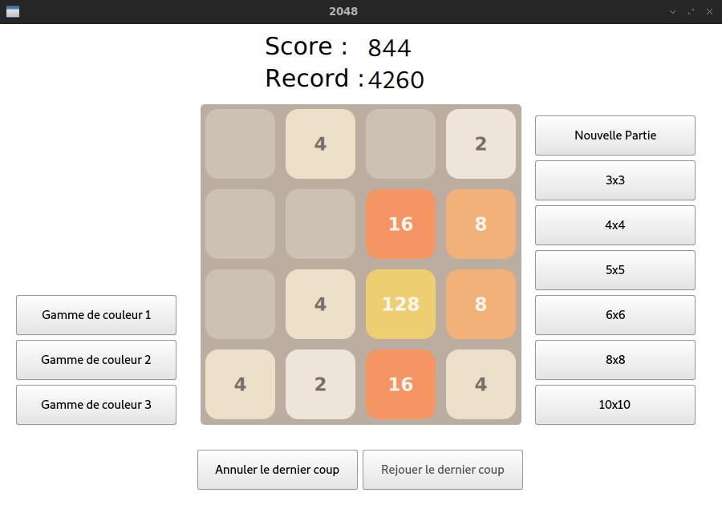

# 2048
Projet de développement du jeu 2048 pour l'action de formation ELC A-11
"Programmation des interfaces graphiques en C++" de l'ECL,
lors du S8 de l'année scolaire 2018-2019.

## Binôme
* Guillaume Groult (guillaume.groult@ecl17.ec-lyon.fr)
* Mathieu Margier (mathieu.margier@ecl17.ec-lyon.fr)

## Notice d'utilisation
L'interface du jeu est la suivante :

Les contrôles pour jouer au 2048 sont :
* Les flèches du clavier pour déplacer les cases vers le haut, le bas, la gauche
ou la droite
* Pour pouvoir annuler un coup, appuyez sur le bouton _Annuler le dernier coup_
en dessous de la grille, ou appuyez simultanément sur Ctrl et Z au clavier
* Pour pouvoir refaire un coup, appuyez sur le bouton _Refaire le dernier coup_
en dessous de la grille, ou appuyez simultanément sur Ctrl et Y au clavier
* Pour commencer une nouvelle partie, appuyez sur le bouton _Nouvelle Partie_
à droite pour rejouer avec une grille de même taille. Pour commencer une
partie avec une grille de taille différente, appuyez sur le bouton de la
taille souhaitée, en dessous du bouton _Nouvelle Partie_
* La combinaison de touches Haut Haut Bas Bas Gauche Droite Gauche Droite B A
déclenche quelque chose...

Le jeu affiche le score de la partie en cours, ainsi que le record personnel
au dessus de la grille.

Une fois que la partie est finie, un message s'affiche au dessus de la grille
pour indiquer si la partie est gagnée ou partie. Si la partie est gagnée
(présence d'un 2048 dans la grille), on peut toutefois continuer de jouer.
Si la partie est finie, on peut en relancer une nouvelle en suivant les
instructions _Nouvelle Partie_ indiquée ci-dessus.
